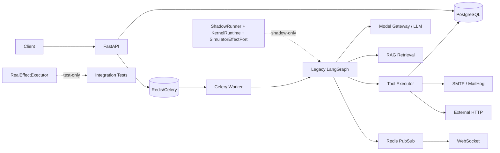
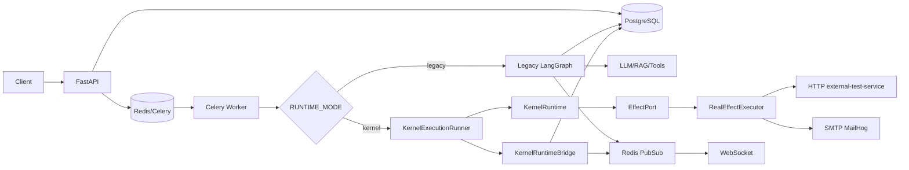

# ARCHITECTURE CHANGE REQUEST

## KernelRuntime Production Mainline Integration

> Status: **APPROVED — PHASE 1 IMPLEMENTED (2026-08-18)**.
> Selected option: **Option A (RUNTIME_MODE → separate runners)**.
> Phase 1 implementation is complete and verified with REAL E2E against live
> PostgreSQL / Redis / Celery / external-test-service / MailHog / Ollama /
> DeepSeek. Kernel, EffectPort, and RealEffectExecutor semantics were not changed.

## Phase 1 Completion Checklist (2026-08-18, REAL-verified)

- [x] `RUNTIME_MODE=legacy` default in `app/config.py`
- [x] Legacy behavior unchanged (real legacy execution completed via API → Celery → LangGraph → DeepSeek)
- [x] `RUNTIME_MODE=kernel` dispatch implemented in `app/engine/tasks.py`
- [x] `KernelExecutionRunner` (`app/adapters/kernel_runner.py`) invoked by Celery worker
- [x] `RuntimeInput` built from real Production Execution/Workflow (`kernel_execution_adapter.py`)
- [x] `KernelRuntime` really executes (termination `TERMINATED_GOAL_SATISFIED` observed)
- [x] `RealEffectExecutor` really executes (via `REAL_EFFECT_MODE=true` + `build_effect_port`)
- [x] `RuntimeOutput` written back to production persistence (`persist_kernel_output`; checkpoint_data + AuditLog KERNEL)
- [x] Existing event system receives Kernel execution events (DB `event_sequence` allocated; Redis publish attempted)
- [x] HTTP OBSERVE REAL PASS (execution `62d1f086-d7ae-4903-8a24-77de1b326e95`, COMPLETED + SATISFIED)
- [x] HTTP MUTATE REAL PASS (real-effect tests via KernelRuntime + external-test-service `/api/external/effect`)
- [x] SMTP MUTATE REAL PASS (execution `4929ff95-38f8-4809-99d8-369a5e6f55b4`; MailHog message `AgentHub-KernelE2E-2a2baf41cefa`)
- [x] Unsupported LLM path explicitly `NOT_SUPPORTED_IN_KERNEL_MODE` (execution `64cbaceb-5d5b-49d3-a71d-4e10c84d3303`, audit 501)
- [x] Kernel does not fall back to Legacy
- [x] Failure injection REAL PASS at effect level (TIMEOUT_BUT_COMMITTED / TIMEOUT_NOT_COMMITTED / DUPLICATE / UNKNOWN / unavailable)
- [ ] Failure injection at infrastructure level (Redis/PostgreSQL down) — not executed
- [x] Full `pytest` PASS (431 passed, 2 skipped when migration-test DB env is set; 10 real-effect tests now PASS with services up)
- [x] `ruff check .` PASS
- [x] `black --check .` PASS
- [x] Kernel isolation PASS (kernel imports no adapter/engine/api/core/models; `import app.kernel` OK)
- [x] Rollback = `RUNTIME_MODE=legacy` (verified: legacy worker completes the same mainline)

## Phase 1 REAL E2E Evidence (2026-08-18)

| Scenario | Execution / Evidence | Result |
|---|---|---|
| Kernel OBSERVE (HTTP) | `62d1f086-d7ae-4903-8a24-77de1b326e95` → `TERMINATED_GOAL_SATISFIED` / `SATISFIED` | REAL PASS |
| Kernel MUTATE (SMTP) + OBSERVE (MailHog verify) | `4929ff95-38f8-4809-99d8-369a5e6f55b4`; MailHog received `AgentHub-KernelE2E-2a2baf41cefa` | REAL PASS |
| Unsupported capability (reason) | `64cbaceb-5d5b-49d3-a71d-4e10c84d3303` → FAILED `NOT_SUPPORTED_IN_KERNEL_MODE`, audit 501 | REAL PASS (negative) |
| Legacy mode unchanged | `956bd166-4c8a-46dd-83d8-049bda1d2066` → COMPLETED, real DeepSeek `final_output`, eval 5.33 | REAL PASS |
| Real effect runtime tests | `tests/integration/test_real_effect_runtime.py` → 10/10 PASS | REAL PASS |

---

## 1. Problem

KernelRuntime is not part of the Production Main Chain.

Current production execution is:

```text
FastAPI
→ PostgreSQL
→ Redis/Celery
→ Worker
→ Legacy LangGraph
→ LLM/RAG/Tools
→ PostgreSQL/Redis PubSub
→ WebSocket
```

KernelRuntime currently runs only as:

```text
RuntimeInput
→ KernelRuntime
→ EffectPort
→ RealEffectExecutor
→ RuntimeOutput
```

Phase 4.6 proved KernelRuntime + RealEffectExecutor REAL PASS. It did not prove the production system is driven by KernelRuntime.

---

## 2. Root Cause

The gap is not that KernelRuntime is broken. The gap is that the production system is an LLM-driven LangGraph runtime, while KernelRuntime is a deterministic state-transition/effect runtime.

Missing production execution bridge:

```text
Live Execution / Workflow / ToolCall / approval / cancel / checkpoint / event
        ↕
RuntimeInput / RuntimeOutput
```

There is a shadow-only adapter (`LegacyExecutionAdapter`), but it only maps legacy snapshots for audit, not live production execution.

---

## 3. Current Architecture



---

## 4. Proposed Architecture



---

## 5. Selected Option

Compared options:

| Dimension | Option A: RUNTIME_MODE → separate runners | Option B: LangGraph → KernelRuntime | Option C: full orchestrator |
|---|---|---|---|
| Architecture fit | Strong for deterministic effect path | Requires touching LangGraph | Strong but larger |
| Implementation complexity | Medium | High | High |
| Kernel isolation | Preserved | Preserved | Preserved |
| Backward compatibility | Best | Medium | Medium |
| Failure semantics | Explicit | Mixed | Explicit |
| Observability | Bridge needed | Bridge needed | Bridge needed |
| Persistence | Bridge needed | Bridge needed | Bridge needed |
| Approval | Out of scope initially | Complex | Complex |
| Cancellation | Out of scope initially | Complex | Complex |
| Checkpoint | Legacy owns checkpoint | Mixed | Mixed |
| Testing | Simple initial scope | Complex | Complex |
| Rollback | `RUNTIME_MODE=legacy` | Rollback plus graph change | Rollback plus orchestrator |

**Selected: Option A**

Reason: it keeps LangGraph untouched, defaults to legacy, and allows a narrowly scoped KernelRuntime path for deterministic effect workflows.

---

## 6. Component Changes

### Required files

| File | Change | Required? | Risk |
|---|---|---|---|
| `app/config.py` | Add `RUNTIME_MODE: str = "legacy"` | Yes | Low |
| `app/engine/tasks.py` | Dispatch to `run_execution` or `run_kernel_execution` | Yes | Medium |
| New `app/adapters/kernel_execution_adapter.py` | Live Execution/Workflow → RuntimeInput | Yes | High |
| New `app/adapters/kernel_runtime_bridge.py` | RuntimeOutput → Execution/ToolCall/audit/event | Yes | High |
| New `app/adapters/kernel_runner.py` | Kernel mode execution loop | Yes | High |
| New `app/adapters/composition.py` | `build_effect_port(settings)` | Yes | Low |
| Tests | Kernel mode unit/integration/REAL tests | Yes | Medium |

### Protected files

| File | Change |
|---|---|
| `app/kernel/*` | Do not touch |
| `app/kernel/effects/port.py` | Do not touch |
| `app/kernel/effects/reconciliation.py` | Do not touch |
| `app/kernel/effects/receipt.py` | Do not touch |
| `app/kernel/goal/evaluator.py` | Do not touch |
| `app/adapters/real_effect_executor.py` | Do not change Phase 4.6 semantics |
| `app/engine/graph.py` | Do not touch |
| `app/engine/runner.py` core LangGraph path | Do not rewrite |
| `app/models/*` | Do not change schema |

---

## 7. RuntimeInput Mapping

`RuntimeInput` requires:

```text
initial_state
plan
goal
capability_registry
artifact_store
effect_port
max_steps
```

### Directly mappable

| Production data | RuntimeInput field | Mapping |
|---|---|---|
| `Execution.id` | `State.context.run_id` | direct |
| `Execution.organization_id` | tenant metadata / artifact metadata | direct |
| `Execution.user_input` | source artifact | direct |
| `Execution.workflow_id` | `State.context.plan_ref` | direct |
| `Workflow.dag_definition` for deterministic nodes | `Plan.tasks` | partial |

### Partially mappable

| Production data | Mapping |
|---|---|
| `Workflow.dag_definition` effect nodes | map only to existing `OBSERVE`/`MUTATE` tasks |
| `Execution.context_messages` | not part of Kernel state; only preserved as artifact metadata |
| `Workflow.agent_chain` | can be read, but Agent reasoning is not a Kernel capability |

### Not mappable

| Production data | Reason |
|---|---|
| LLM research/analyze/execute nodes | Kernel has no LLM capability |
| RAG context | Kernel has no RAG capability |
| Tool approval | Kernel has no approval state machine |
| Cancellation | Kernel has no cancellation state machine |
| LangGraph checkpoint | Kernel is not LangGraph runtime |
| Evaluation | LLM-as-Judge is not Kernel GoalEvaluator |
| Usage/billing | Kernel does not estimate tokens/cost |

---

## 8. RuntimeOutput Mapping

| RuntimeOutput | Production Object | Mapping |
|---|---|---|
| `final_state` | Execution / audit | Partial: observations/receipts can be persisted as JSON; no text final output |
| `goal_result` | Execution.status | Rule mapping: SATISFIED → COMPLETED, otherwise FAILED |
| `execution_trace` | audit / JSON | Partial: persist as JSON trace |
| `effect_history` | ToolCall / audit | Partial: one command maps to one audit record; not a native ToolCall |
| `termination_reason` | Execution.status/error | Direct rule mapping |
| `error` | Execution.error_message | Direct |
| `final_output` | Execution.final_output | Not present in Kernel; adapter must define deterministic output |

Proposed status mapping:

```text
TERMINATED_GOAL_SATISFIED → COMPLETED
TERMINATED_NO_PATH → FAILED
TERMINATED_RETRY_EXHAUSTED → FAILED
TERMINATED_UNKNOWN_EFFECT → FAILED
TERMINATED_MAX_STEPS → FAILED
TERMINATED_ERROR → FAILED
```

---

## 9. LLM Boundary

LangGraph nodes:

| Node | LLM-dependent | Produces state | Produces tool call | Produces Effect | Kernel task? |
|---|---|---|---|---|---|
| `classify_task` | Yes | Yes | No | No | No |
| `research_agent` | Yes | Yes | `search_web` | External search | No |
| `analyze_agent` | Yes | Yes | No | No | No |
| `execute_agent` | Yes | Yes | `query_db`, `send_email` | DB / SMTP | No |

Decision:

- KernelRuntime must not own LLM.
- `openai`, `langchain`, `langgraph` must stay outside `app/kernel/`.
- LLM planning/reasoning remains in legacy engine for Phase 1.

---

## 10. RAG Boundary

RAG belongs to the production engine/adapter layer, not Kernel:

```text
document
→ embedding
→ retrieval
→ context
→ LLM
```

`sentence-transformers`, PostgreSQL document lookup, vector search, and LangChain integration must stay outside `app/kernel/`.

---

## 11. Approval / Cancellation

Legacy path:

```text
LangGraph interrupt
→ ToolCall PENDING
→ API approve/reject
→ resume_execution
```

KernelRuntime does not implement approval/cancel.

Phase 1 decision:

- Kernel mode initially supports only non-approval deterministic effects.
- Approval/cancellation remains legacy-only.
- Do not add approval/cancel capability to Kernel in this ACR.

---

## 12. Checkpoint

`AsyncPostgresSaver` is a LangGraph checkpoint, not a Kernel runtime checkpoint.

Decision:

- Legacy execution continues using LangGraph checkpoint.
- Kernel mode does not use LangGraph checkpoint in Phase 1.
- Kernel mode persistence is limited to Execution/ToolCall/audit JSON.

---

## 13. Event / WebSocket

Required bridge:

```text
KernelRuntime
→ KernelRuntimeBridge
→ event_bus.publish_execution_event
→ Redis PubSub
→ WebSocket
```

Kernel must not import Redis or WebSocket.

Proposed event schema:

```json
{
  "execution_id": "...",
  "correlation_id": "...",
  "event": "kernel_node_started|effect_started|receipt_recorded|reconciliation_updated|observation_recorded|execution_completed|execution_failed",
  "step": 1,
  "command_id": "...",
  "idempotency_key": "...",
  "external_reference": "...",
  "sequence": 1
}
```

---

## 14. Persistence

Required boundary:

```text
KernelRuntime
→ pure data (RuntimeOutput)
→ Adapter/Bridge
→ PostgreSQL
```

Prohibited:

```text
KernelRuntime → SQLAlchemy
KernelRuntime → Redis
```

---

## 15. Effect

Phase 4.6 semantics must be reused unchanged:

```text
KernelRuntime
→ EffectPort
→ RealEffectExecutor
→ HTTP / SMTP
→ Receipt
→ Reconciliation
→ Observation
→ GoalEvaluator
```

Preserved:

- Receipt
- Reconciliation
- Observation
- Idempotency
- Retry
- UNKNOWN
- DUPLICATE
- TIMEOUT

`RealEffectExecutor` is a stable interface for this ACR.

---

## 16. Rollback

Immediate rollback:

```text
RUNTIME_MODE=legacy
```

After setting, Production Main Chain returns to legacy LangGraph without code rollback.

---

## 17. Testing Strategy

### Unit

- Runtime mode dispatch defaults to legacy.
- RuntimeInput/Output adapters map fields deterministically.
- status/termination mapping.

### Integration

- Kernel mode dispatch reaches KernelRuntime.
- `build_effect_port` injects SimulatorEffectPort or RealEffectExecutor based on config.

### REAL E2E

- `RUNTIME_MODE=legacy` with real PostgreSQL/Redis/Celery.
- `RUNTIME_MODE=kernel` with real PostgreSQL/Redis/Celery and `external-test-service` / `MailHog`.

### Failure Injection

- Redis down
- PostgreSQL down
- Celery worker down
- external HTTP down
- MailHog down

### Regression

- Full `pytest`
- `ruff check .`
- `black --check .`
- Kernel dependency scan

---

## 18. Risk Matrix

| Risk | Probability | Impact | Mitigation | Rollback |
|---|---|---|---|---|
| Kernel mode accidentally enabled for existing tenants | Low | High | default `legacy`, tenant allowlist | set `RUNTIME_MODE=legacy` |
| RuntimeOutput mapping loses audit data | Medium | High | bridge writes JSON audit before status commit | legacy mode |
| Duplicate external effect across legacy/kernel | Medium | High | reuse `idempotency_key` and external dedup | legacy mode + cleanup |
| Approval/cancel unsupported in kernel mode | Medium | Medium | restrict kernel mode to non-approval scenarios | legacy mode |
| LLM/RAG cannot run in kernel mode | High | High | keep LLM/RAG in legacy | legacy mode |
| Checkpoint loss | Low | High | do not use kernel mode for checkpoint-dependent workflows | legacy mode |
| Redis/DB outage | Medium | High | existing health checks + failure-safe wrapper | restart service |

---

## 19. Migration Plan

### Phase A — Shadow

- Add `RUNTIME_MODE` config.
- Add adapters and bridge.
- Run kernel mode only in shadow/audit; legacy result unchanged.

### Phase B — Kernel opt-in

- Explicit tenant/workflow allowlist.
- Run deterministic effect workflows in kernel mode.
- Compare against legacy for selected cases.

### Phase C — Canary

- Small percentage of eligible workflows.
- Monitor error rate, duplicate effects, DLQ, reconciliation mismatch.

### Phase D — Production default

- Only after LLM/RAG/approval/checkpoint boundaries are fully resolved.
- Do not set kernel as global default until all production capabilities have a defined path.

---

## 20. Final Recommendation

**KernelRuntime is NOT READY for full Production Mainline replacement.**

It is conditionally ready for a narrowly scoped deterministic effect path:

```text
RUNTIME_MODE=kernel
→ KernelExecutionRunner
→ KernelRuntime
→ RealEffectExecutor
→ HTTP/SMTP
→ persistence/event bridge
```

Exact blockers for full production runtime:

1. LLM research/analyze/execute capabilities are not in Kernel.
2. RAG is not in Kernel.
3. Approval/cancellation/checkpoint are not in Kernel.
4. RuntimeOutput lacks natural-language `final_output`, evaluation, usage, and billing mapping.
5. Production Execution/ToolCall/event bridge is not implemented.

Minimal remediation for Phase 1 deterministic path:

- Add `RUNTIME_MODE` default `legacy`.
- Add `KernelExecutionAdapter`, `KernelRuntimeBridge`, and composition root.
- Restrict Phase 1 to `OBSERVE`/`MUTATE` deterministic effects only.
- Keep LLM/RAG/approval/checkpoint on legacy path.
