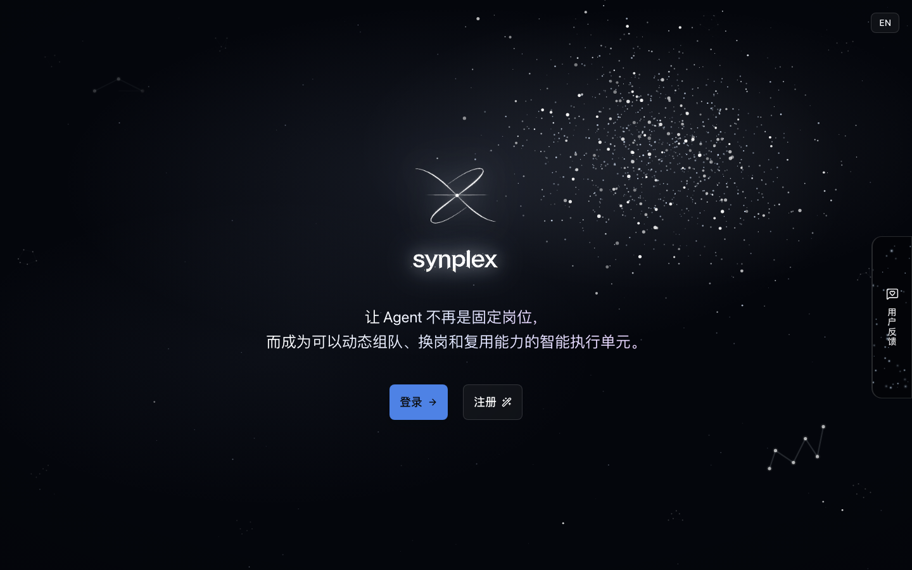
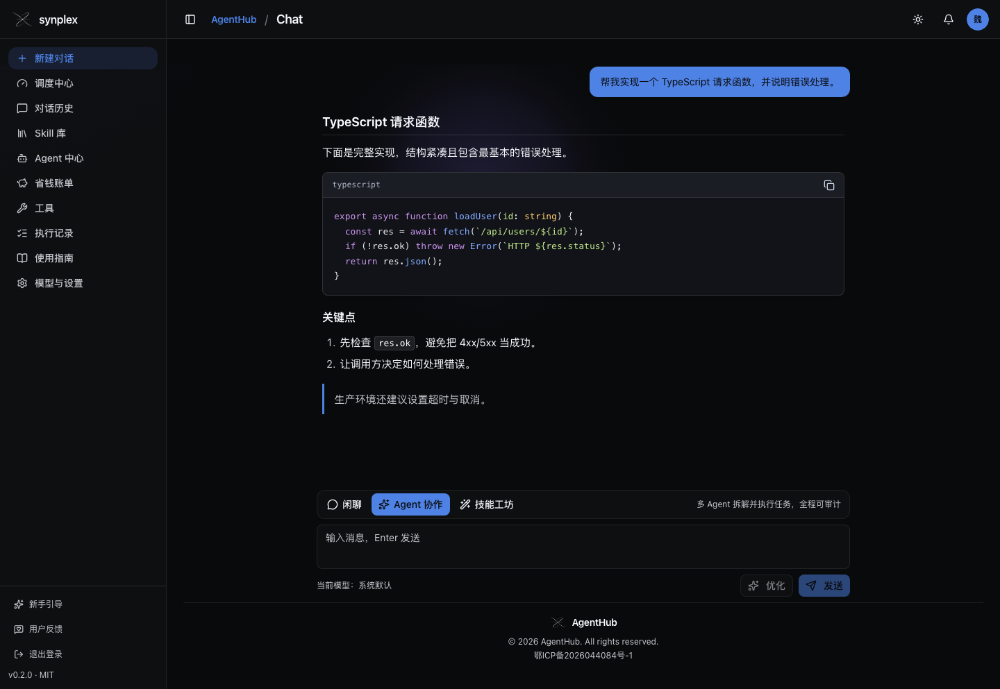
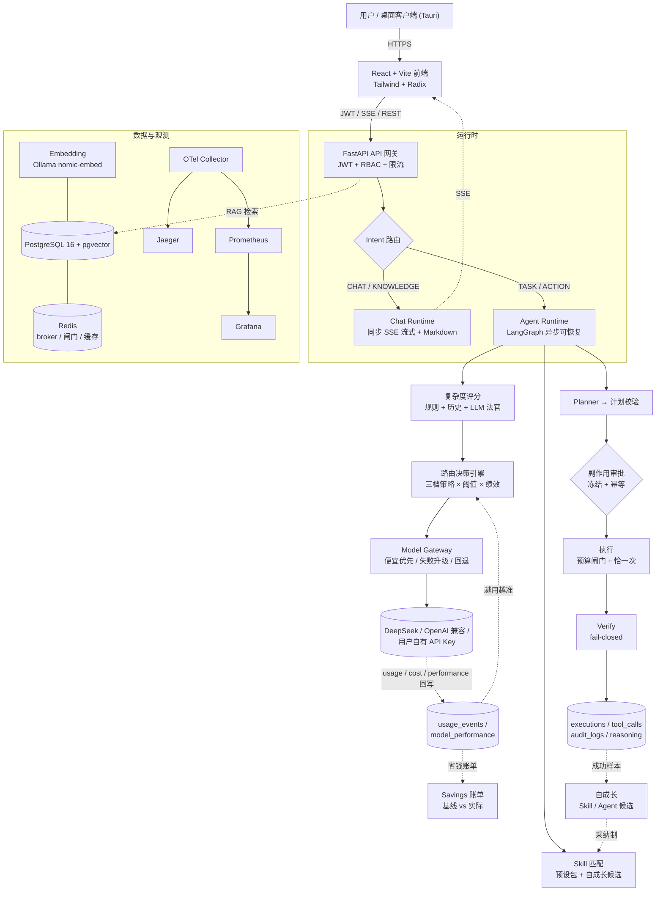
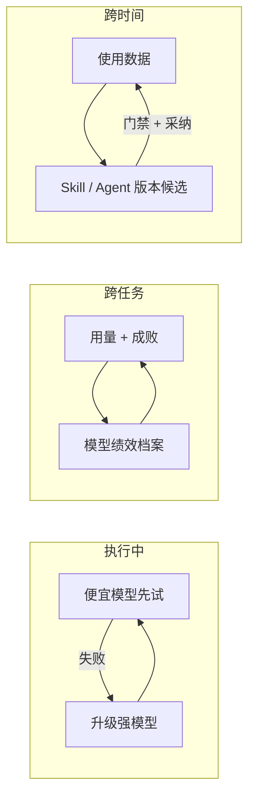

# AgentHub（对外品牌 Synplex）

> **模型越多，越不会用。AgentHub 是你的动态调度中枢**：接上你所有的模型 API，
> 发布任务后它分析复杂度、为每一步自动选最便宜的模型；便宜模型失败自动升级强模型，
> 用最少的 token 完成最复杂的任务；执行全程可观看、可审计、可澄清、可回滚，
> 最后给你一张省钱账单。

生产站：<https://synplex.xyz>

---

## 界面预览

| 首页 | 对话 |
| --- | --- |
|  |  |

> 首页截取自生产站首页（未登录状态）；对话截图由真实 Chat 前端组件渲染了一段 Markdown 回答
> 采集而来，用于展示代码块、列表与引用排版。

---

## 架构

### 系统总览



### 三个动态闭环



> 三个闭环的共同底线：**每次变化都有版本、有记录、可回滚**。

### 可靠性层

幂等 claim（副作用恰一次）→ `IN_FLIGHT/UNKNOWN` fail-closed → 审批冻结（T24，运行时 mismatch
→ 零副作用 → 审计 → abort）→ reconciliation → checkpoint/resume → DLQ → 预算原子闸门。

### 关键不变量

- Intent → Runtime 静态映射；complexity 只影响模型策略；
- 非法计划 → `plan_invalid`（不静默降级）；
- 副作用预算超限硬终止，只读超限优雅终止；
- 所有 LLM 调用经 Model Gateway；所有重试经 `failure.py` 分层。

### 生产工具与能力

真实生产工具（6 个）：`search_web / query_db / search_knowledge / recall_memory /
recall_executions / send_email`。能力目录：`backend/app/engine/capabilities.py`。

> 明确的边界：`send_sms / create_ticket / refund_order` 等仅存在于 benchmark fixture，
> 不是生产工具；Prompt Injection 防线仍在设计冻结待评审。

---

## 当前真实能力

> 本文档只描述有代码、测试或运行证据的能力。边界详见
> [ARCHITECTURE.md](ARCHITECTURE.md)、[FEATURES.md](docs/FEATURES.md)、
> [PROJECT_BOUNDARIES.md](docs/PROJECT_BOUNDARIES.md) 与
> [DISPATCH_CENTER.md](docs/DISPATCH_CENTER.md)。

### 动态调度中枢（核心，全部闭环）

- **复杂度评分器**：规则信号 + 历史统计 + 可选 LLM 法官三层混合，任务级/步骤级两级评分；
- **路由策略引擎**：三档策略（省钱/均衡/质量）\* 阈值 \* 模型绩效修正 → 每步决策；
  升级阶梯（每步 ≤1 次、每任务 ≤4 次）；每次决策落 `routing_decisions` 审计表；
- **澄清中断**：语义歧义/参数缺失 → 暂停弹选项 → 你选择 → 断点继续（全程留痕）；
  超限显式失败、零副作用；
- **Skill 系统**：8 个预设任务包 + 自动匹配 + 自成长（候选需你采纳才生效）；
- **多 Agent 体系**：自带 6 Agent（调度/规划/执行/验证/澄清/记账）+ 版本化自更新；
- **省钱账单**：实际成本 vs “全程最强模型”基线 + 逐模型 token 看板；
- **MCP 插件**：`POST /api/mcp` 把调度中心暴露为 MCP 工具集（JSON-RPC 2.0 over HTTP，
  Bearer JWT），Claude/Codex 等外部助手可直接调用。

### 可靠交付与观测

- 认证（邮箱验证码注册、登录、刷新、找回、JWT、登录/全局限流、安全响应头）；
- 多租户：`organization_id` 贯穿业务表；`query_db` 强制注入租户谓词；
- Chat：SSE 流式 + Markdown 渲染；Agent：Intent → 复杂度 → Planner → LangGraph → Verify；
- 可靠性：Approval Freeze、幂等、fail-closed、reconciliation、checkpoint/resume、DLQ、预算闸门；
- 观测：`audit_logs` + `tool_calls` + span 持久化；OTel → Jaeger / Prometheus / Grafana；
- RAG：文档 → 分块 → Ollama `nomic-embed-text`（768d）→ pgvector → top-k；
- 记忆：长期记忆显式读写删 + 检索，租户隔离；
- 成本：模型价格配置 + 每次调用 usage/cost + 租户预算（Redis 原子闸门）。

### 明确的边界（L2 部分 / L1 声明）

- Kernel 确定性内核：代码与单测真实，生产 `RUNTIME_MODE` 未启用；
- 双供应商回退（OpenAI）：代码存在，开关默认关闭且密钥未充值；
- RBAC：admin/member/viewer + 路由依赖，细粒度策略证据有限；
- Workflow/DAG：编辑器与映射存在，执行仍以串行为主。

---

## 快速开始（本地）

前置：Python 3.11+、Node.js 20+、Docker Desktop。

```bash
git clone https://github.com/weijiakang8-dotcom/Agenthub.git
cd Agenthub
python3 -m venv .venv
. .venv/bin/activate
python -m pip install --upgrade pip
python -m pip install -r backend/requirements.txt
cp .env.example .env          # 填入所需模型和工具凭据
docker compose -f docker/docker-compose.yml up -d postgres redis mailhog embedding
cd backend
python -m alembic upgrade head
python -m uvicorn app.main:app --port 8000
```

另开终端启动 worker：

```bash
cd Agenthub && . .venv/bin/activate && cd backend
python -m celery -A app.engine.tasks.celery_app worker --loglevel=warning --pool=solo
```

另开终端启动前端：

```bash
cd Agenthub/frontend && npm ci && npm run dev   # http://localhost:5173
```

登录后：左侧「调度中心」先分析任务 →「新建对话」发布 → 执行全程直播 →「省钱账单」看账。

## macOS 桌面客户端

桌面客户端采用 Tauri v2，完整复用 React 前端并直接连接 `https://synplex.xyz/api`，
本机无需 Docker：

```bash
cd frontend
npm run desktop:dev     # 开发
npm run desktop:build   # 生成 .app + .dmg
```

详见 [docs/DESKTOP_CLIENT.md](docs/DESKTOP_CLIENT.md)。

## 技术栈

- 后端：Python 3.11 / FastAPI / SQLAlchemy(asyncpg) / LangGraph / Celery / Redis；
- 数据：PostgreSQL 16 + pgvector；Embedding：Ollama `nomic-embed-text`；
- 模型：DeepSeek（OpenAI 兼容端点）+ 用户自有 API Key；Model Gateway 统一路由/重试/回退/成本；
- 前端：React + Vite + TypeScript + Tailwind + Radix（深色/浅色双主题）；
- 部署：Docker Compose（backend/worker/frontend/postgres/redis/mailhog/embedding + 监控栈）。

## 测试

```bash
cd backend && python -m pytest -q                    # 103 个测试文件，689 用例通过
cd ../frontend
npm ci && npm run typecheck && npm run test:run && npm run lint && npm run build
npm run test:e2e                                     # 需要本地后端已启动
```

Benchmark（真实模型，需显式开启）：

```bash
cd backend
BENCH_REAL_MODELS=1 python -m tests.benchmark.phase1.run_1a
BENCH_REAL_MODELS=1 PHASE1B_MODE=full python -m tests.benchmark.phase1.run_1b
```

> 数字以 `python -m pytest -q` 实际输出为准；本 README 以最近一次全量成功为基准：
> `689 passed, 21 skipped`。

## 生产部署

- 生产站：https://synplex.xyz（腾讯云 Ubuntu，Docker Compose）；
- 部署/回滚：`deploy/production-deploy.sh`（fetch+reset → 构建 → 健康门禁 → 失败自动回滚）；
  `deploy/rollback.sh`（回上一稳定 commit）；
- 备份/恢复：`scripts/backup.sh`（pg_dump + gzip，保留 7 份）、`scripts/restore.sh`；
- GitHub Actions：`ci.yml`（测试/迁移/Playwright + lint/format 门禁）、`benchmark-gate`、
  `deploy.yml`（显式 SHA + 生产 Environment 审批 + 健康验证）、`desktop.yml`（macOS 打包）；
- 生产部署必须在**正式环境审批**下进行：校验目标在 main 祖先链 + 所需 CI 全绿 +
  runner 无 Docker 直连 + health/build_sha 验证通过。

## License

[Apache License 2.0](LICENSE)
