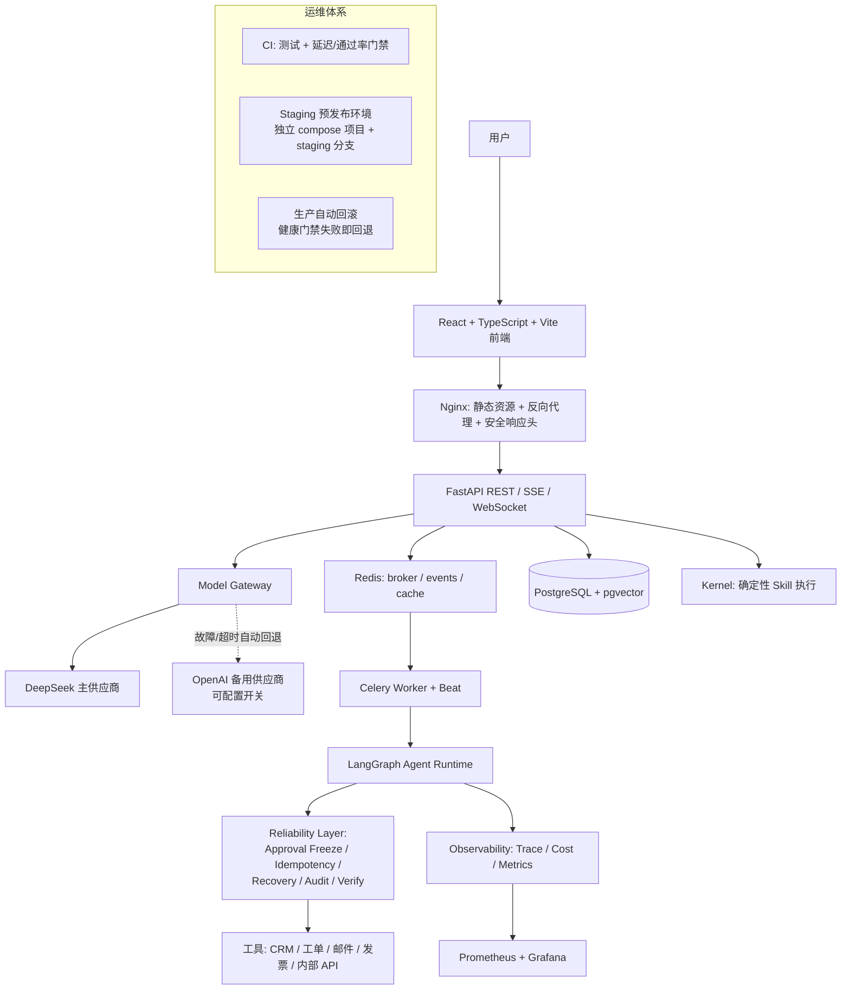

# AgentHub — 企业级 Agent 生产运行时

> 让 AI 从"会回答"走向"敢执行"。

AgentHub 把概率性的 AI 决策，转化为企业可以**验证、控制、审计、恢复**的确定性业务执行。
它不是一个聊天机器人或工作流 Demo，而是一套面向真实副作用的
**Agent Production Runtime / Reliability Layer**。

## 一句话产品假设

> Reliability Layer 把 LLM 的概率性错误限制在决策层，
> 让更小、更便宜的模型也能承担真实业务执行。

核心能力不是"功能多"，而是五个可靠性支柱：

1. **可靠执行**：副作用恰好一次、崩溃可恢复、UNKNOWN fail-closed。
2. **边界控制**：审批冻结（Approval Freeze），运行期参数不一致即中止。
3. **全程审计**：每次执行可还原、可追责、可导出。
4. **质量可证明**：任务级评测与四象限基准（Safe Success / 拦截率 / 成本）。
5. **成本可控**：per-request 成本、预算闸门、双供应商回退降本。

## 已上线功能

- 认证：账号+密码登录（无验证码）、注册（邮箱验证码 + 确认密码）、找回密码、
  JWT（access 30min / refresh 7d）自动刷新、登录防爆破限流。
- 账户体验：密码明文/密文一键切换、表单实时校验、全站核心入口悬浮提示（Tooltip）。
- 多租户与权限：org/user 隔离、RBAC（admin/member/viewer）、动作级审计。
- 三运行时：Chat（SSE 流式）、Agent（异步 Planner→执行→Verify→完成）、
  Kernel（确定性 Skill 执行内核）。
- 工作流：可视化 DAG 编辑器、人工审批节点、断点续跑、执行轨迹与可靠性面板。
- 模型层：多模型网关、**DeepSeek 主 + OpenAI 备用双供应商自动回退**（可配置开关，
  未配置/未充值自动跳过，绝不阻塞主流程）。
- 可靠性层：Approval Freeze（T24 显式 mismatch 中止）、幂等状态机（claim/IN_FLIGHT/
  UNKNOWN）、副作用不重试、对账幂等、审批悬挂超时收敛、DLQ、checkpoint 保留。
- 评测体系：Phase 0 事故回归集、Phase 1A/1B 真实模型四象限基准（416 runs）、
  任务级评测看板（SSR/SOR/USER/GCR/成本）。
- 运维：Staging 预发布环境、生产自动回滚、CI 功能与延迟回归门禁、
  前后端安全响应头（Nginx + API 双层）。
- 数据：PostgreSQL + pgvector、Redis、成本计量、告警、邮件（SMTP/Resend 回退）。

## 架构



## 核心契约（Frozen Core）

- Approval Freeze：审批载荷冻结 `{plan_hash, approval_id, side_effect_proposals}`；
  运行期 tool/params 与冻结提案不一致 → 零副作用 + `approval_mismatch` 审计 + 中止。
- Idempotency：`tool_calls` 是副作用唯一事实源；
  `PENDING → claim → IN_FLIGHT → SUCCESS/FAILED/REJECTED`；IN_FLIGHT 遇恢复 = UNKNOWN，
  绝不自动重放。
- Tool Retry：副作用工具 claim 后 provider 调用 ≤1；TIMEOUT/TRANSIENT → UNKNOWN。
- Verify Fail-Closed：PASS/FAIL/UNKNOWN/ERROR 四态，UNKNOWN/ERROR 不触发 replan、不冒充 PASS。
- Reconciliation 幂等：重复运行零状态变化、零重复审计。

## 快速开始

```bash
git clone https://github.com/weijiakang8-dotcom/Agenthub.git
cd Agenthub
cp .env.example .env              # 填写 DeepSeek/OpenAI 备用密钥（备用未充值可保持关闭）
docker compose -f docker/docker-compose.yml up -d --build
open http://localhost:8080
```

双供应商回退配置（.env）：

```env
OPENAI_FALLBACK_ENABLED=false   # 充值并填入密钥后改为 true 即启用
OPENAI_FALLBACK_API_KEY=
OPENAI_FALLBACK_BASE_URL=https://api.openai.com/v1
OPENAI_FALLBACK_MODEL=gpt-4o-mini
```

## 测试与评测

```bash
cd backend && pytest -q            # 全量后端（含契约/集成）
cd frontend && npm run test:run    # 前端单测
cd backend && BENCH_REAL_MODELS=1 PHASE1B_MODE=full python -m tests.benchmark.phase1.run_1b
```

评测口径见
[SAFE_CONTAINED_METRICS_CONTRACT](backend/tests/benchmark/SAFE_CONTAINED_METRICS_CONTRACT.md)
与 [PHASE1B_EXPERIMENT_SPEC](backend/tests/benchmark/PHASE1B_EXPERIMENT_SPEC.md)。

## 部署

- 生产：GitHub Actions `deploy.yml` → `deploy/production-deploy.sh`
  （稳定点记录 + 健康门禁 + 失败自动回滚）。
- 预发布：`staging` 分支 → `staging.yml` → `deploy/staging-deploy.sh`
  （独立 `agenthub-staging` compose 项目，内部端口 8001/8081/5434/6380）。
- 手动回滚：`bash deploy/rollback.sh`（默认回退到 `deploy/.last-good-commit`）。

## 项目进度

- ✅ 生产化：三运行时、认证、多租户、审批/幂等/恢复、审计、成本、告警。
- ✅ 可靠性契约：T24 / C-1 / C-4 / C-2 / Verify Fail-Closed（含回归）。
- ✅ 基准：Phase 0 十事故、Phase 1A 60 runs、Phase 1B 416 runs、任务级评测看板。
- ✅ 双供应商回退架构、Staging、自动回滚、CI 门禁、安全头、文档同步。
- ⏳ 待评审：Prompt Injection 防线（设计稿冻结，未实现）。
- ⏳ 待业务阶段：真实用户流量验证、真实第二供应商充值启用。

## 后续规划

1. Prompt Injection 防线（Decision Integrity Guard）评审通过后实现。
2. 真实客户与真实流量验证产品假设。
3. RAG hybrid 检索 / citation / rerank。
4. Trace Viewer / Approval UX / Context Budget 的进一步产品化。

## License

MIT
