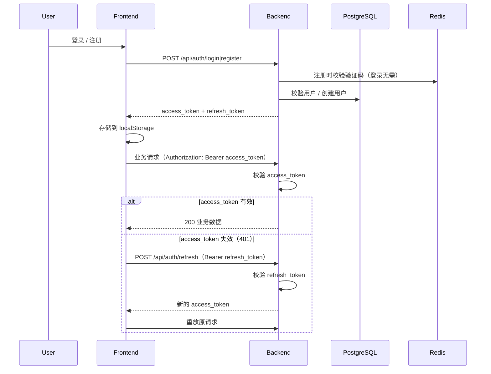

# AgentHub 认证架构

本文档说明 AgentHub 的认证与鉴权设计，覆盖注册、登录、Token 刷新、密码找回与安全策略。

## 技术栈

- Backend: FastAPI + PyJWT（HS256）
- Database: PostgreSQL（用户与组织数据）
- Cache: Redis（验证码与限流）
- Frontend: React + TypeScript（`fetch` 封装，无 Axios）
- Email: SMTP（本地 MailHog / 生产 SMTP），未配置 SMTP 时回退 Resend

## 1. JWT 流程

AgentHub 使用无状态 JWT，`access_token` 有效期 30 分钟，`refresh_token` 有效期 7 天。



### Token 类型

| Token | 有效期 | 用途 |
|---|---:|---|
| access_token | 30 分钟 | 访问业务 API |
| refresh_token | 7 天 | 获取新的 access_token |

Token 载荷包含：

- `sub`: 用户 UUID
- `org`: 组织 UUID
- `type`: `access` 或 `refresh`
- `iat` / `exp`: 签发时间 / 过期时间

## 2. 注册流程

```text
输入姓名 / 邮箱 / 密码
    ↓
点击获取验证码 → POST /api/auth/send-code (mode=register)
    ↓
邮箱存在 → 409 EMAIL_ALREADY_EXISTS
邮箱不存在 → 生成 6 位验证码 → Redis 5 分钟 → 发送邮件
    ↓
提交注册 → POST /api/auth/register
    ↓
校验密码长度 → 校验验证码 → 创建 Organization + User
    ↓
返回 access_token + refresh_token
```

注册时每个新用户都会创建一个独立组织，用户默认角色为 `admin`。

## 3. 登录流程

```text
输入邮箱 / 密码
    ↓
提交登录 → POST /api/auth/login
    ↓
校验邮箱 + 密码（不校验邮箱验证码）
    ↓
失败统一返回“账号或密码错误”，不暴露邮箱是否存在
    ↓
成功返回 access_token + refresh_token
```

> 登录已移除邮箱验证码，仅保留账号 + 密码；邮箱验证码只在注册与找回密码环节生效。
> `/api/auth/send-code` 的 `mode=login` 分支为兼容旧调用方保留，返回
> `{"status":"ok","note":"login does not require an email code"}`，不发送邮件。

## 4. Refresh 流程

```text
业务请求返回 401
    ↓
Frontend 读取 localStorage 中的 refresh_token
    ↓
POST /api/auth/refresh（Authorization: Bearer refresh_token）
    ↓
后端区分三种结果：
  - refresh_token 过期 → 401 REFRESH_TOKEN_EXPIRED
  - refresh_token 无效 → 401 INVALID_REFRESH_TOKEN
  - 校验通过 → 200 { access_token }
    ↓
Frontend 更新 access_token 并重放原请求
```

前端在 `request` 层实现单飞（single-flight）刷新：并发请求同时 401 时只触发一次 refresh，成功后重放各自请求。刷新失败时清空所有 token，并抛出“登录已过期，请重新登录”。

## 5. 密码找回流程

```text
输入注册邮箱 → POST /api/auth/forgot-password
    ↓
为防邮箱枚举，始终返回“如果该邮箱已注册，我们会发送验证码”
    ↓
验证码（6 位，10 分钟）→ POST /api/auth/verify-reset-code
    ↓
输入新密码 → POST /api/auth/reset-password
    ↓
消费验证码 → 更新 password_hash → 记录 password_changed_at
    ↓
返回登录
```

## 6. 安全设计

### 密码存储

- PBKDF2-HMAC-SHA256 + 随机盐，迭代 10 万次。
- 不存储明文密码；`verify_password` 使用 `hmac.compare_digest` 防时序攻击。

### 验证码防爆破

- 注册验证码：6 位数字，5 分钟有效，单次使用，连续失败 5 次失效。
- 重置密码验证码：6 位数字，10 分钟有效，单次使用，连续失败 5 次失效。

### 邮箱枚举防护

- 忘记密码接口返回统一提示，不暴露邮箱是否注册；登录统一返回“账号或密码错误”。
- 注册接口保留“邮箱已注册”提示，便于引导用户直接登录或找回密码。

### Token 存储与风险说明

当前 `access_token` 与 `refresh_token` 存储在浏览器 `localStorage`：

- 优点：实现简单，跨页面共享，配合 Vite/Nginx 部署无需 Cookie 配置。
- 风险：`localStorage` 可被同源 JavaScript 读取，若应用存在 XSS 漏洞，token 可能被窃取。
- 缓解：access_token 缩短到 30 分钟；logout 时清理全部 token；前端不渲染任何外部不可信 HTML。

如需更高安全等级，可将 refresh_token 迁移到 `HttpOnly + Secure + SameSite` Cookie，并在后端增加 CSRF 防护；当前版本为保持技术栈与现有业务逻辑不变，仍使用 localStorage。

### 邮件服务

- 优先使用 SMTP（本地开发对应 `docker-compose` 的 MailHog `localhost:1025`）。
- SMTP 未配置时回退 Resend。
- 所有配置通过 `.env` 注入，不硬编码。

## 7. 相关文件

- `backend/app/core/security.py`：密码哈希与 JWT 签发/校验
- `backend/app/api/routes/auth.py`：认证 API
- `backend/app/core/email.py`：SMTP / Resend 邮件发送
- `backend/app/models/user.py`：用户模型
- `frontend/src/lib/api.ts`：token 存储、错误解析、401 自动刷新
- `frontend/src/components/AuthModal.tsx`：登录 / 注册 / 找回密码 UI
