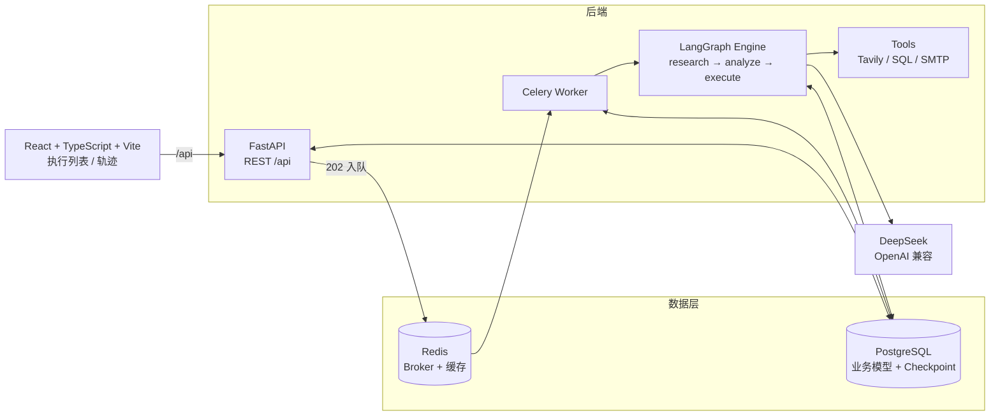

# AgentHub 系统架构

## 架构图

## 执行流程

1. 前端调用 `POST /api/executions` 创建工作流实例。
2. FastAPI 创建 `Execution`（初始状态 `pending`），通过 Celery 将 `execute_workflow_task` 投递到 Redis 队列，并立即返回 `202 Accepted`。
3. Celery Worker 消费任务，调用 `runner.run_execution`：
   - 加载 `Execution` 与 `Workflow`，解析 `agent_chain` 得到执行步骤。
   - 编译 LangGraph 状态图，并挂载 `AsyncPostgresSaver` 作为 Checkpoint。
   - 依次执行 `research → analyze → execute` 三个 Agent 节点，每个节点调用 DeepSeek LLM。
   - 敏感工具（如 `send_email`）触发 `interrupt`，进入 `waiting_for_approval`。
4. 执行结束后更新状态为 `completed`（或 `failed`），前端通过 `/status`、`/trace` 轮询查看结果。

## 核心数据模型

- `Agent`：智能体定义（名称、系统提示词、工具、状态）
- `Workflow`：工作流定义（agent_chain、状态、创建者）
- `Execution`：工作流运行实例（状态、当前步骤、Checkpoint、输入输出）
- `ToolCall`：工具调用审计日志（参数、结果、审批状态）

## 断点续跑

- LangGraph 在每个节点执行后通过 `AsyncPostgresSaver` 持久化 Checkpoint。
- 出现 `GraphInterrupt` 时，Execution 状态置为 `waiting_for_approval`。
- `POST /api/executions/{id}/resume` 使用 `Command(resume=decision)` 从 Checkpoint 恢复执行。
